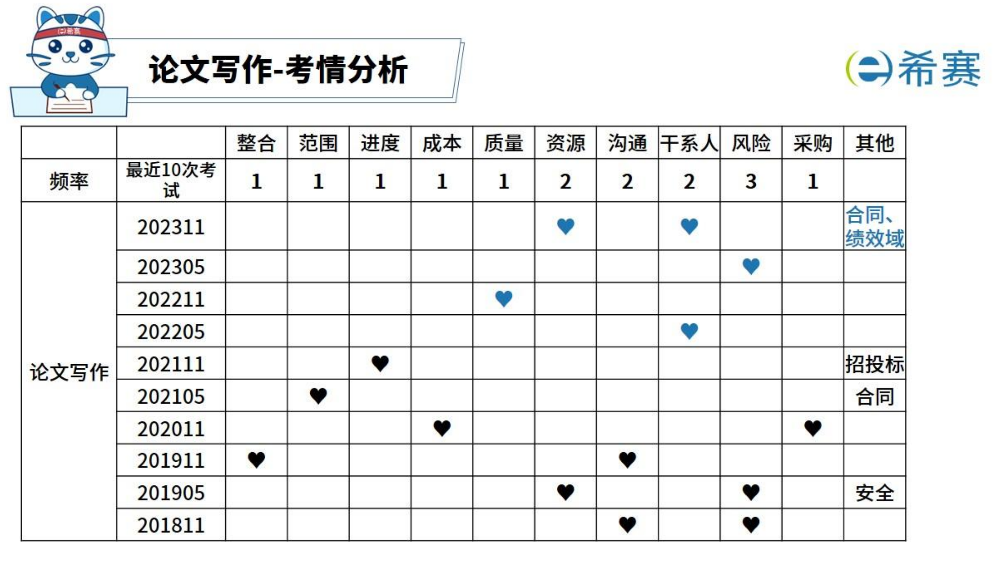

# SeniorProjectManagementEngineer
## 学习方法
### 1. 刷视频
希赛视频：https://wangxiao.xisaiwang.com/wangxiao2/c250008812/sp100495284.html

#### ✅2024上半年信息系统项目管理师-致远班
1. 备考策略分析
2. 项目管理概论
3. 项目立项管理
4. 项目整合管理
5. 项目范围管理
6. 论文写作-框架
7. 项目进度管理
8. 项目成本管理
9. 项目质量管理
10. 项目资源管理
11. 论文写作-论信息系统项目的范围管理
12. 项目沟通管理
13. 项目干系人管理
14. 项目风险管理
15. 项目采购管理
16. 配置与变更管理
17. 项目管理原则与项目绩效域
18. 高级项目管理
19. 管理科学基础
20. 案例专题-计算题
21. 案例分析
22. 论文写作-论信息系统项目的沟通管理
23. 信息化发展
24. 信息技术发展
25. 信息系统管理与治理
26. 信息系统工程
27. 信息系统安全管理
28. 法律法规与标准规范
29. 论文写作-论信息系统项目成本管理
30. 论文写作-论信息系统项目团队绩效域
31. 论文写作-论信息系统项目规划绩效域
32. 论文写作-论信息系统项目交付绩效域
#### ✅2024上半年信息系统项目管理师-冲刺班
1. 综合知识
1.1. 综合知识-01（5.11）
开始学习60分钟 已学习:99%
1.2. 综合知识-02（5.11）
开始学习60分钟 已学习:100%
1.3. 综合知识-03（5.12）
开始学习68分钟 已学习:100%
1.4. 综合知识-04（5.12）
开始学习53分钟 已学习:100%
1.5. 综合知识-05（5.12）
开始学习62分钟 已学习:100%
1.6. 综合知识-06（5.12）
开始学习100分钟 已学习:100%
2. 案例和论文
2.1. 案例和论文-01（5.16）
开始学习77分钟 已学习:100%
2.2. 案例和论文-02（5.16）
开始学习115分钟 已学习:100%
2.3. 案例和论文-03（5.18）
开始学习79分钟 已学习:100%
提示：你上次看到这里！

2.4. 案例和论文-04（5.18）
开始学习76分钟 已学习:71%
2.5. 案例和论文-05（5.18）
开始学习65分钟 已学习:0%
2.6. 案例和论文-06（5.18）
开始学习68分钟 已学习:0%
2.7. 案例和论文-07（5.18）
开始学习41分钟 已学习:100%
2.8. 案例和论文-08（5.19）
开始学习68分钟 已学习:100%
2.9. 案例和论文-09（5.19）
开始学习45分钟 已学习:100%
2.10. 案例和论文-10（5.19）
### 2. 做题
希赛题目：https://wangxiao.xisaiwang.com/tiku2/list-dp132-1.html?

#### ✅历年真题
✅2024年上半年模拟考试

✅2023年下半年信息系统项目管理师论文考试真题（第四批次）	
 0/1

✅2023年下半年信息系统项目管理师考试下午真题（第四批次）（专业解析+参考答案）	
 0/1

✅2023年下半年信息系统项目管理师考试上午真题（第四批次）（专业解析+参考答案）	
 0/35

2023年下半年信息系统项目管理师论文考试真题（第三批次）	
 0/1

2023年下半年信息系统项目管理师论文考试真题（第二批次）	
 0/1

✅2023年上半年信息系统项目管理师考试下午真题（专业解析+参考答案）	
 0/3

2023年上半年信息系统项目管理师论文真题（专业解析）	
 0/1

✅2023年上半年信息系统项目管理师考试上午真题（专业解析+参考答案）	
 0/73

2022年下半年信息系统项目管理师考试论文真题（专业解析）	
 0/1

✅2022年下半年信息系统项目管理师考试下午真题（专业解析+参考答案）	
 0/3

✅2022年下半年信息系统项目管理师考试上午真题（专业解析+参考答案）	
 0/72

2022年上半年信息系统项目管理师考试论文真题（专业解析）	
 0/1

✅2022年上半年信息系统项目管理师考试下午真题（专业解析+参考答案）	
 0/3

✅2022年上半年信息系统项目管理师考试上午真题（专业解析+参考答案）	
 0/73

2021年下半年信息系统项目管理师考试论文真题（专业解析）

2021年下半年信息系统项目管理师考试下午真题（专业解析+参考答案）	
 0/3

2021年下半年信息系统项目管理师考试上午真题（专业解析+参考答案）	
 0/73

2021年上半年信息系统项目管理师考试下午真题（专业解析+参考答案）	
 0/3

2021年上半年信息系统项目管理师考试论文真题（专业解析）	
 0/2
0%	重新做题测试报告
2021年上半年信息系统项目管理师考试上午真题（专业解析+参考答案）	
 0/73

2020年信息系统项目管理师考试论文真题（专业解析）	
 0/2

2020年信息系统项目管理师考试下午真题（专业解析+参考答案）	
 0/3

2020年信息系统项目管理师考试上午真题（专业解析+参考答案）	
 0/73

#### ✅每日一练	
2024年05月07日信息系统项目管理师每日一练	
 10/10
70.00%	重新做题
2024年05月06日信息系统项目管理师每日一练	
 10/10
90.00%	重新做题测试报告
2024年05月05日信息系统项目管理师每日一练	
 10/10
70.00%	重新做题测试报告
2024年05月04日信息系统项目管理师每日一练	
 10/10
50.00%	重新做题测试报告
2024年05月03日信息系统项目管理师每日一练	
 10/10
40.00%	重新做题测试报告
2024年05月02日信息系统项目管理师每日一练	
 10/10
80.00%	重新做题测试报告
2024年05月01日信息系统项目管理师每日一练	
 10/10
60.00%	重新做题测试报告
2024年04月30日信息系统项目管理师每日一练	
 10/10
90.00%	重新做题测试报告
2024年04月29日信息系统项目管理师每日一练	
 10/10
60.00%	重新做题测试报告
2024年04月28日信息系统项目管理师每日一练	
 10/10
80.00%	重新做题测试报告
2024年04月27日信息系统项目管理师每日一练	
 10/10
60.00%	重新做题测试报告
2024年04月26日信息系统项目管理师每日一练	
 10/10
65.00%	重新做题测试报告
2024年04月25日信息系统项目管理师每日一练	
 10/10
80.00%	重新做题测试报告
2024年04月24日信息系统项目管理师每日一练	
 10/10
50.00%	重新做题测试报告
2024年04月23日信息系统项目管理师每日一练	
 10/10
50.00%	重新做题测试报告
2024年04月22日信息系统项目管理师每日一练

2024年04月21日信息系统项目管理师每日一练	
 10/10
100%	重新做题测试报告
2024年04月20日信息系统项目管理师每日一练	
 10/10
50.00%	重新做题测试报告
2024年04月19日信息系统项目管理师每日一练	
 9/10
70.00%	重新做题测试报告
2024年04月18日信息系统项目管理师每日一练	
 10/10
70.00%	重新做题测试报告
2024年04月17日信息系统项目管理师每日一练	
 10/10
100%	重新做题测试报告
2024年04月16日信息系统项目管理师每日一练	
 10/10
80.00%	重新做题测试报告
2024年04月15日信息系统项目管理师每日一练	
 10/10
60.00%	重新做题测试报告
2024年04月14日信息系统项目管理师每日一练	
 10/10
60.00%	重新做题测试报告
2024年04月13日信息系统项目管理师每日一练	
 10/10
75.00%	重新做题测试报告
2024年04月12日信息系统项目管理师每日一练	
 10/10
65.00%	重新做题测试报告
2024年04月11日信息系统项目管理师每日一练	
 10/10
60.00%	重新做题测试报告
2024年04月10日信息系统项目管理师每日一练	
 9/10
50.00%	重新做题测试报告
2024年04月09日信息系统项目管理师每日一练	
 10/10
50.00%	重新做题测试报告
2024年04月08日信息系统项目管理师每日一练	
 10/10
80.00%	重新做题测试报告
2024年04月07日信息系统项目管理师每日一练

2024年04月06日信息系统项目管理师每日一练	
 10/10
80.00%	重新做题测试报告
2024年04月05日信息系统项目管理师每日一练	
 10/10
80.00%	重新做题测试报告
2024年04月04日信息系统项目管理师每日一练	
 10/10
70.00%	重新做题测试报告
2024年04月03日信息系统项目管理师每日一练	
 0/10

2024年04月02日信息系统项目管理师每日一练	
 0/10

2024年04月01日信息系统项目管理师每日一练	
 0/10

2024年03月31日信息系统项目管理师每日一练	
 0/10

2024年03月30日信息系统项目管理师每日一练	
 10/10
70.00%	重新做题测试报告
2024年03月29日信息系统项目管理师每日一练	
 10/10
45.00%	重新做题测试报告
2024年03月28日信息系统项目管理师每日一练	
 10/10
40.00%	重新做题测试报告
2024年03月27日信息系统项目管理师每日一练	
 10/10
80.00%	重新做题测试报告
2024年03月26日信息系统项目管理师每日一练	
 10/10
90.00%	重新做题测试报告
2024年03月25日信息系统项目管理师每日一练	
 10/10
50.00%	重新做题测试报告
2024年03月24日信息系统项目管理师每日一练	
 10/10
60.00%	重新做题测试报告
2024年03月23日信息系统项目管理师每日一练	

2024年03月22日信息系统项目管理师每日一练	
 10/10
70.00%	重新做题测试报告
2024年03月21日信息系统项目管理师每日一练	
 10/10
60.00%	重新做题测试报告
2024年03月20日信息系统项目管理师每日一练	
 10/10
60.00%	重新做题测试报告
2024年03月19日信息系统项目管理师每日一练	
 9/10
60.00%	重新做题测试报告
2024年03月18日信息系统项目管理师每日一练	
 8/10
70.00%	重新做题测试报告
2024年03月17日信息系统项目管理师每日一练	
 10/10
30.00%	重新做题测试报告
2024年03月16日信息系统项目管理师每日一练

### 看思维导图
✅01信息化发展

✅02信息技术发展

✅03信息系统治理

✅04信息系统管理

✅05信息系统工程

✅06项目管理概论

✅07项目立项管理
## 题型
### 选择题
前期每日一练+后期刷真题
### 案例题
刷真题

[软考机考画图操作指南] https://www.educity.cn/rk/5160589.html
### 论文题

#### 十大管理
##### ✅干系人管理（5.12）

论文练习
论信息系统项目的干系人管理3（2024上）

查看
论信息系统项目的干系人管理2（2024上）

查看
论信息系统项目的干系人管理1（2024上）

查看
论信息系统项目的干系人管理3（2023下）

查看
论信息系统项目的干系人管理2（2023下）

查看
论信息系统项目的干系人管理1（2023下）

查看
论信息系统项目的干系人管理2（2023上）

查看
论信息系统项目的干系人管理1（2023上）

##### ✅合同管理（5.13）我感觉不太会考

论文练习
论信息系统项目的合同管理（2024上）

查看
##### ✅整合管理（5.20）

论文练习
论信息系统项目的整合管理4（2024上）

查看
论信息系统项目的整合管理3（2024上）

查看
论信息系统项目的整合管理2（2024上）

查看
论信息系统项目的整合管理1（2024上）

查看
论信息系统项目的整体管理3（2023下）

查看
论信息系统项目的整合管理2（2023下）

查看
论信息系统项目的整合管理1（2023下）

查看
论信息系统项目的整合管理3（2023上）

查看
论信息系统项目的整合管理2（2023上）

查看
论信息系统项目的整体管理1（2023上）

查看
论信息系统项目的整体管理5（2022下）

查看
论信息系统项目的整体管理4（2022下）

查看
论信息系统项目的整体管理3（2022下）

查看
论文信息系统项目整体管理2（2022下）

查看
论文信息系统项目整体管理1（2022下）

查看
##### ✅范围管理（5.17）

论文练习
论信息系统项目的范围管理4（2024上）

查看
论信息系统项目的范围管理3（2024上）

查看
论信息系统项目的范围管理2（2024上）

查看
论信息系统项目的范围管理1（2024上）

查看
论信息系统项目的范围管理3（2023下）

查看
论信息系统项目的范围管理2（2023下）

查看
论信息系统项目的范围管理1（2023下）

查看
论信息系统项目的范围管理3（2023上）

查看
论信息系统项目的范围管理2（2023上）

查看
论信息系统项目的范围管理1（2023上）

查看
论信息系统项目的范围管理4（2022下）

查看
论信息系统项目的范围管理3（2022下）

查看
论信息系统项目的范围管理2（2022下）

查看
论信息系统项目的范围管理1（2022下）

查看
##### ✅进度管理（5.16）

论文练习
论信息系统项目的进度管理4（2024上）

查看
论信息系统项目的进度管理3（2024上）

查看
论信息系统项目的进度管理2（2024上）

查看
论信息系统项目的进度管理1（2024上）

查看
论信息系统项目的进度管理3（2023下）

查看
论信息系统项目的进度管理2（2023下）

查看
论信息系统项目的进度管理1（2023下）

查看
论信息系统项目的进度管理3（2023上）

查看
论信息系统项目的进度管理2（2023上）

查看
论信息系统项目的进度管理1（2023上）

查看
论信息系统项目的进度管理4（2022下）

查看
论信息系统项目的进度管理3（2022下）

查看
论信息系统项目的进度管理2（2022下）

查看
论信息系统项目的进度管理1（2022下）

查看
##### ✅成本管理（5.18）

论文练习
论信息系统项目的成本管理4（2024上）

查看
论信息系统项目的成本管理3（2024上）

查看
论信息系统项目的成本管理2（2024上）

查看
论信息系统项目的成本管理1（2024上）

查看
论信息系统项目的成本管理3（2023下）

查看
论信息系统项目的成本管理2（2023下）

查看
论信息系统项目的成本管理1（2023下）

查看
论信息系统项目的成本管理4（2023上）

查看
论信息系统项目的成本管理3（2023上）

查看
论信息系统项目的成本管理2（2023上）

查看
论信息系统项目的成本管理1（2023上）

查看
论信息系统项目的成本管理3（2022下）

查看
论信息系统项目的成本管理2（2022下）

查看
论信息系统项目的成本管理1（2022下）

查看
##### ✅资源管理(5.11)

论文练习
论信息系统项目的资源管理4（2024上）

查看
论信息系统项目的资源管理3（2024上）

查看
论信息系统项目的资源管理2（2024上）

查看
论信息系统项目的资源管理1（2024上）

查看
论信息系统项目的资源管理3（2023下）

查看
论信息系统项目的资源管理2（2023下）

查看
论信息系统项目的资源管理1（2023下）

查看
论信息系统项目的人力资源管理3（2023上）

查看
论信息系统项目的人力资源管理2（2023上）

查看
论信息系统项目的人力资源管理1（2023上）

查看
##### ✅质量管理（5.15）

论文练习
论信息系统项目的质量管理4（2024上）

查看
论信息系统项目的质量管理3（2024上）

查看
论信息系统项目的质量管理2（2024上）

查看
论信息系统项目的质量管理1（2024上）

查看
论信息系统项目的质量管理3（2023下）

查看
论信息系统项目的质量管理2（2023下）

查看
论信息系统项目的质量管理1（2023下）

查看
论信息系统项目的质量管理3（2023上）

查看
论信息系统项目的质量管理2（2023上）

查看
论信息系统项目的质量管理1（2023上）

查看
论信息系统项目的质量管理2（2022下）

查看
论信息系统项目的质量管理1（2022下）

查看

##### ✅沟通管理（5.21）

论文练习
论信息系统项目的沟通管理4（2024上）

查看
论信息系统项目的沟通管理3（2024上）

查看
论信息系统项目的沟通管理2（2024上）

查看
论信息系统项目的沟通管理1（2024上）

查看
论信息系统项目的沟通管理3（2023下）

查看
论信息系统项目的沟通管理2（2023下）

查看
论信息系统项目的沟通管理1（2023下）

查看
论信息系统项目的沟通管理3（2023上）

查看
论信息系统项目的沟通管理2（2023上）

查看
论信息系统项目的沟通管理1（2023上）

查看
##### ✅采购管理（5.19）

论文练习
论信息系统项目的采购管理4（2024上）

查看
论信息系统项目的采购管理3（2024上）

查看
论信息系统项目的采购管理2（2024上）

查看
论信息系统项目的采购管理1（2024上）

查看
论信息系统项目的采购管理4（2023下）

查看
论信息系统项目的采购管理3（2023下）

查看
论信息系统项目的采购管理2（2023下）

查看
论信息系统项目的采购管理1（2023下）

查看
论信息系统项目的采购管理3（2023上）

查看
论信息系统项目的采购管理2（2023上）

查看
论信息系统项目的采购管理1（2023上）

查看
##### ✅风险管理（5.14）

论文练习
论信息系统项目的风险管理4（2024上）

查看
论信息系统项目的风险管理3（2024上）

查看
论信息系统项目的风险管理2（2024上）

查看
论信息系统项目的风险管理1（2024上）

查看
论信息系统项目的风险管理4（2023下）

查看
论信息系统项目的风险管理3（2023下）

查看
论信息系统项目的风险管理2（2023下）

查看
论信息系统项目的风险管理1（2023下）

查看
论信息系统项目的风险管理3（2023上）

查看
论信息系统项目的风险管理2（2023上）

查看
论信息系统项目的风险管理1（2023上）

查看
##### 其它

论文练习
论信息系统项目的人力资源管理和成本管理

查看
论信息系统项目的风险管理与安全管理

查看
论信息系统项目的需求管理和范围管理1

查看
论信息系统项目的需求管理和范围管理2

查看
#### ✅绩效域
度量绩效域

查看
开发方法和生命周期绩效域

查看
规划绩效域1（2024上）

查看
不确定性绩效域1（2024上）

查看
交付绩效域1（2024上）

查看
团队绩效域2（2024上）

查看
团队绩效域1（2024上）

查看
干系人绩效域（2024上）注：本文内容较多，自行裁剪。

查看
工作绩效域（2024上）

查看

## 冲刺
背！背！背！背！背！背！

### ✅冲刺班pdf资料
### 论文模版+案例
5.25号论文考了进度管理，5.26就不会考了

我猜测论文重要性：

整合管理、成本管理、范围管理、质量管理

马老师说的：立项、配置、绩效域、高级项目管理
### 冲刺班思维导图
### 速记口诀